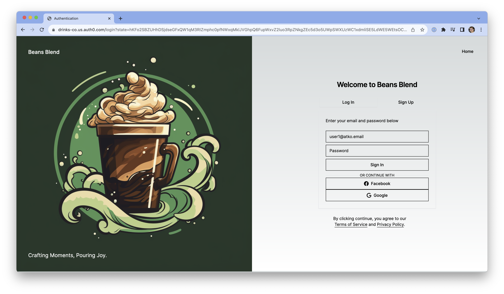

# Drinks Co Demo for Auth0 B2C Multi-branding on CUL 

For landing page visit https://drinks-co.vercel.app

Branding format is as follows

* [Drinks Co](https://drinks-co.vercel.app) is the holding and has two child brands. Users are stored here.
  * [Beans Blend](https://beans-blend.vercel.app) produces coffee and tea beverages 
  * [Fizzy Fusion](https://fizzy-fusion.vercel.app) produces fizzy soft drinks
  

## Screenshots
### Login Page

### Email
#### Template

#### Rendered

### Application/Connection

### User Profile and Metadata

